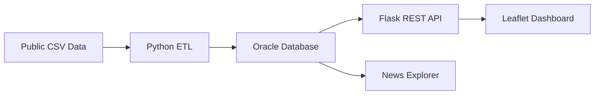

# 살핌 | Lonely Death Risk Platform

> 지역별 사회·복지·의료 데이터를 결합해 고독사 상대적 취약도를 비교하고 정책 우선순위를 탐색하는 B2G 분석 플랫폼입니다.

## Overview

2019~2021년 공공데이터와 고독사 관련 뉴스 데이터를 Oracle Database에 적재하고, Flask API와 지도 기반 대시보드로 제공합니다. 이 서비스의 점수는 실제 고독사 발생 확률이 아니라 지역 간 상대적 취약도를 나타내는 정책 참고 지표입니다.



4인 팀 프로젝트로 진행했으며, 문상진은 팀장과 PM을 맡았습니다.

## My Contribution

- 4인 팀의 팀장·PM으로 프로젝트 일정, 범위와 역할 조율
- 서로 단위가 다른 지역 지표를 비교하기 위한 Min-Max 정규화 설계·구현
- 결측 지표를 제외하고 남은 가중치를 100%로 재분배하는 종합 취약도 로직 구현
- 메인 지도, KPI 카드, 반원 게이지, 범례, 지역 상세 UI 설계·구현
- 뉴스 탐색 화면과 서비스 화면 간 정보 구조 정리

## Vulnerability Score

각 지표를 지역 최솟값과 최댓값을 기준으로 0~100 범위로 정규화합니다.

$$
z_i = \frac{x_i - \min(x)}{\max(x)-\min(x)} \times 100
$$

종합 점수에는 고독사와의 상관계수를 바탕으로 한 상대 가중치를 적용했습니다.

| Indicator | Raw weight |
|---|---:|
| Unmet medical need | 0.59 |
| Elderly population ratio | 0.39 |
| One-person household ratio | 0.25 |
| Population per welfare worker | 0.15 |

지역에 특정 지표가 없으면 0점으로 처리하지 않습니다. 해당 지표를 계산에서 제외하고 사용 가능한 지표들의 가중치 합으로 다시 나눠, 결측이 곧 낮은 위험으로 해석되는 오류를 막았습니다.

## Features

- 시·도별 고독사 상대 취약도 지도
- 1인가구, 고령인구, 복지 인력, 미충족 의료 KPI
- 종합 취약도 점수와 위험 구간 시각화
- 지역명 정규화 및 통합 지역 조회 처리
- 연도·언론사·정렬 조건을 지원하는 뉴스 탐색
- 뉴스 키워드 빈도와 워드클라우드 데이터 제공
- Oracle 바인드 변수를 사용한 지역별 데이터 조회

## API

| Method | Endpoint | Description |
|---|---|---|
| GET | `/api/region/<region>` | 지역별 통합 취약 지표 |
| GET | `/api/one-person/<region>` | 1인가구 지표 |
| GET | `/api/unmet-medical/<region>` | 미충족 의료율 |
| GET | `/api/welfare/<region>` | 사회복지 종사자 지표 |
| GET | `/api/elderly/<region>` | 고령인구 지표 |
| GET | `/news` | 뉴스 검색·분석 화면 |
| GET | `/api/test` | DB 연결 확인 |

## Tech Stack

| Layer | Technology |
|---|---|
| Language | Python, JavaScript, SQL |
| Backend | Flask |
| Database | Oracle Database, python-oracledb |
| Data | pandas, CSV ETL |
| Frontend | HTML, CSS, Leaflet, OpenStreetMap |

## Project Structure

```text
├── python/          # Flask API and news processing
├── database/        # Oracle schema and data loaders
├── html/            # Dashboard and news UI
├── css/             # Service styles
├── data/            # Reproducible indicator datasets
├── preprocess.py    # Population preprocessing
└── requirements.txt
```

기존 가상환경, 캐시, macOS 메타데이터와 기획 문서는 공개용 저장소에서 제외했습니다. 용량이 크고 기사 본문을 포함한 파생 뉴스 CSV도 코드 저장소에서 제외했으며, 뉴스 적재 코드는 별도 데이터 파일을 주입하는 방식으로 유지했습니다. 코드에 있던 로컬 Oracle 경로와 비밀번호는 환경 변수 방식으로 변경했습니다.

## Run Locally

```bash
python -m venv .venv
source .venv/bin/activate
pip install -r requirements.txt
cp .env.example .env
```

`.env`에 Oracle 접속 정보를 설정한 뒤 스키마와 데이터를 적재합니다.

```bash
python database/02_insert_data.py
python database/03_insert_welfare.py
python database/04_insert_elderly.py
python python/insert_news.py
python python/app.py
```

기본 주소는 `http://127.0.0.1:5000`입니다.

## Engineering Decisions

- 지표별 단위 차이를 제거하기 위해 Min-Max 정규화를 사용했습니다.
- 결측값을 0으로 대체하지 않고 가중치를 재분배해 의미 왜곡을 줄였습니다.
- 지역명 별칭을 API 계층에서 표준 행정구역명으로 변환했습니다.
- 원천 데이터, 적재 코드, API, UI를 분리해 각 단계를 독립적으로 확인할 수 있게 했습니다.
- 취약도와 실제 발생 확률을 명확히 구분해 화면에 설명했습니다.

## Limitations & Next Steps

- 현재 데이터 기간은 2019~2021년 중심이며 최신 데이터 갱신 파이프라인이 없습니다.
- 지표 가중치는 상관관계 기반으로, 인과관계를 의미하지 않습니다.
- 테스트, 구조화 로그, 헬스 체크와 CI/CD가 필요합니다.
- Oracle을 컨테이너 또는 관리형 DB로 구성하고 마이그레이션을 자동화할 수 있습니다.
- 스케줄 ETL, 데이터 품질 검사, API 모니터링을 추가하면 클라우드 운영 포트폴리오로 확장할 수 있습니다.
